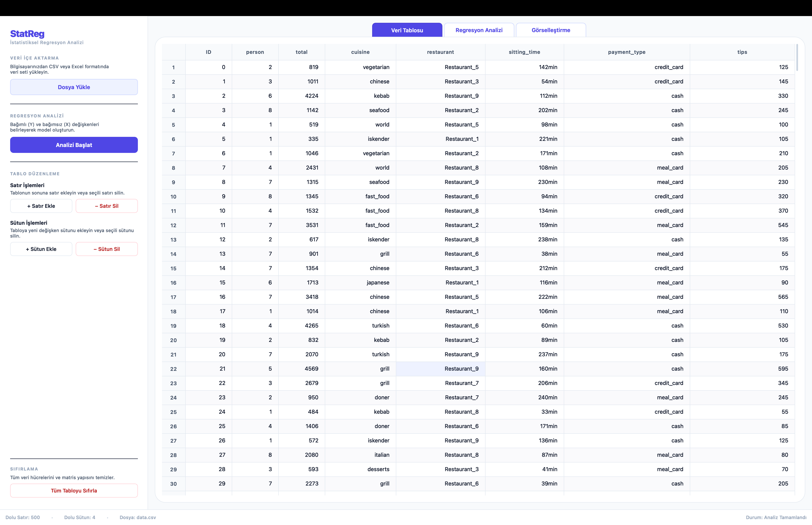
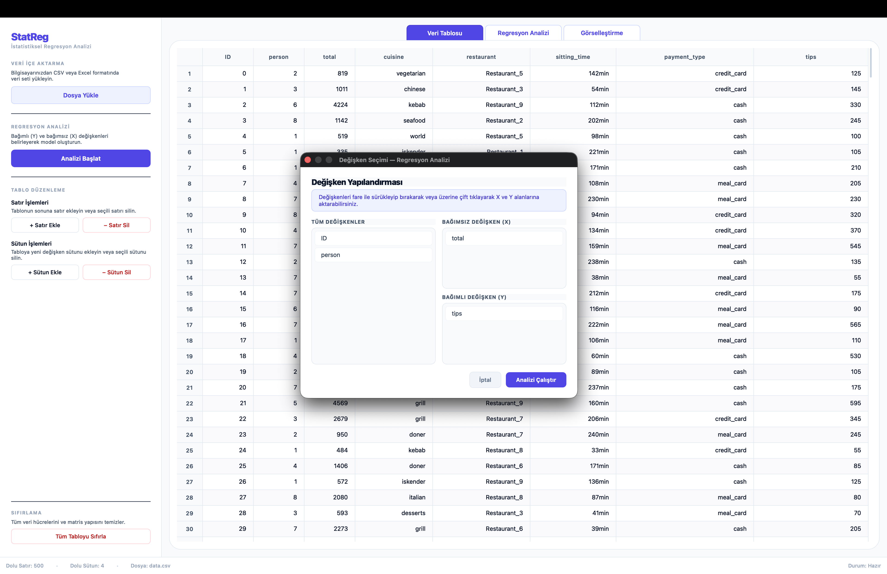
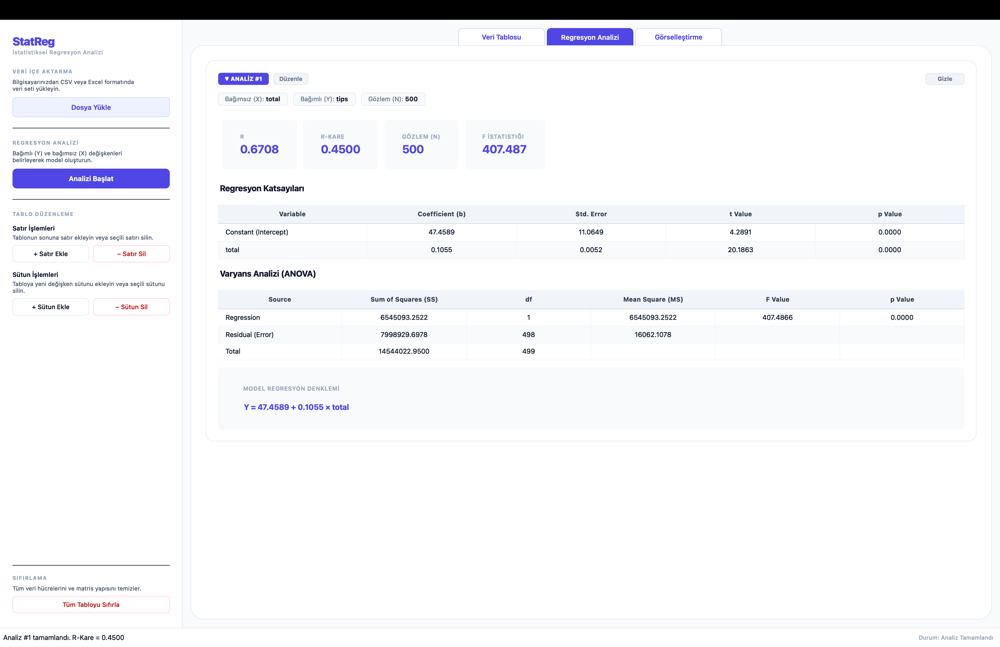
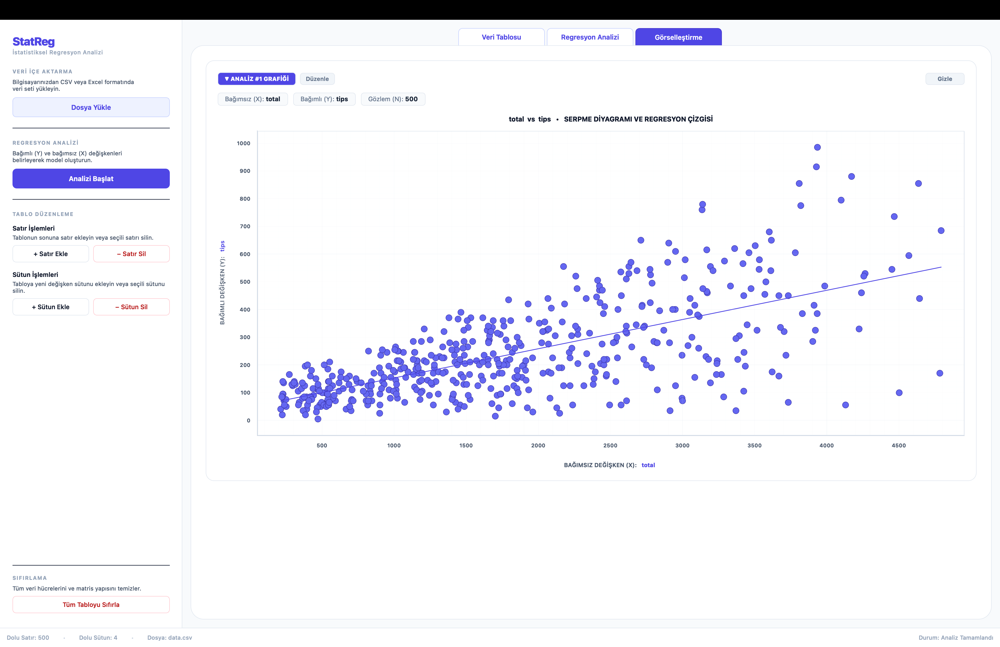
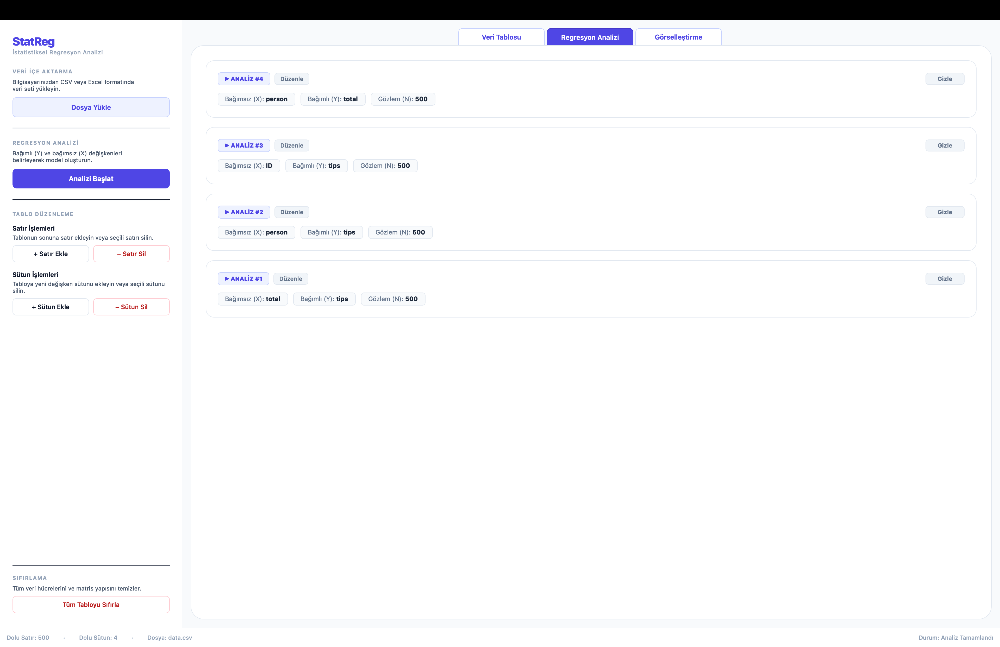
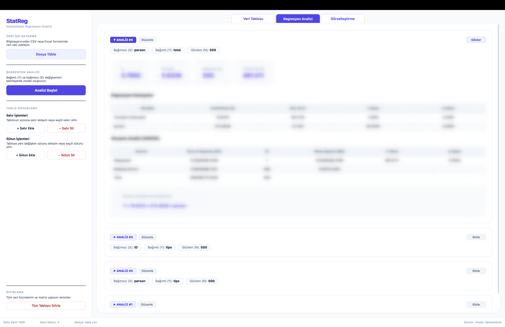
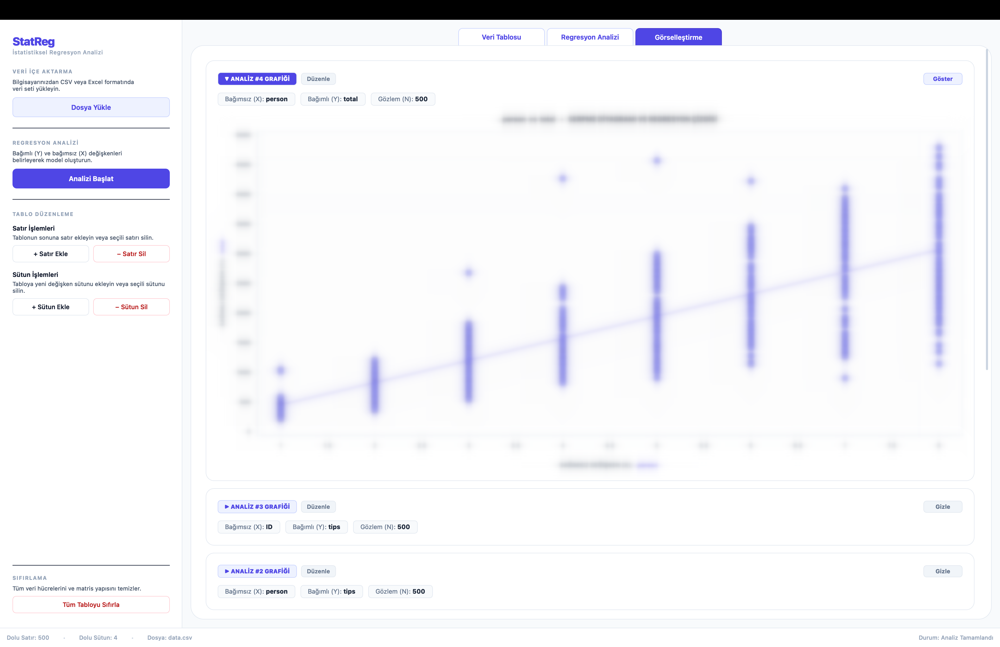

# StatReg - İstatistiksel Regresyon Analizi Aracı

Bu proje, veri bilimciler ve istatistikçiler için tasarlanmış, PyQt6 ile geliştirilmiş bir istatistiksel regresyon analizi ve görselleştirme masaüstü uygulamasıdır. Kullanıcılar CSV formatındaki veri setlerini yükleyebilir, değişken atamaları yapabilir, regresyon modellerini kurabilir ve sonuçları görselleştirebilirler.

Aşağıda uygulamanın temel kullanım adımları görseller referans alınarak sırasıyla açıklanmıştır:

## 1. Veri İçe Aktarma ve Tablo Görünümü

Uygulamanın ana ekranında, "Veri Tablosu" sekmesi yer almaktadır. Sol menüden CSV formatında yüklenen veri seti (örneğin `data.csv`), ana ekranda bir veri çerçevesi (dataframe) yapısında görüntülenir.
- Tablo üzerinde satır ve sütun ekleme veya silme gibi ön işleme adımları sol paneldeki "Tablo Düzenleme" menüsünden yapılabilir.
- Alt kısımda toplam dolu satır (gözlem) ve sütun (değişken) sayıları takip edilebilir.

## 2. Değişken Seçimi ve Model Kurulumu

Sol panelden "Analizi Başlat" butonuna tıklandığında, modeli kurmak için bir "Değişken Yapılandırması" penceresi açılır.
- Veri setindeki tüm özellikler "TÜM DEĞİŞKENLER" havuzunda listelenir.
- Kullanıcı, sürükle-bırak yöntemiyle veya çift tıklayarak analiz etmek istediği Bağımsız Değişkeni (X) ve Bağımlı Değişkeni (Y) belirler. Görseldeki örnekte, `total` (X) bağımsız, `tips` (Y) ise bağımlı değişken olarak atanmıştır. "Analizi Çalıştır" ile model hesaplaması başlatılır.

## 3. Regresyon Analizi Çıktıları

Model çalıştırıldıktan sonra "Regresyon Analizi" sekmesine geçiş yapılır. Bu ekranda oluşturulan modelin istatistiksel özet tablosu sunulur:
- **Temel Metrikler:** R (Korelasyon katsayısı), R-Kare (Belirlilik katsayısı), Gözlem (N) sayısı ve F İstatistiği en üstte vurgulanır.
- **Regresyon Katsayıları:** Sabit terim (Intercept) ve bağımsız değişkenin katsayısı, standart hata, t-değeri ve p-değeri (anlamlılık) ile birlikte listelenir.
- **Varyans Analizi (ANOVA):** Modelin genel istatistiksel anlamlılığını test etmek için Serbestlik Derecesi (df), Kareler Toplamı (SS) ve Kareler Ortalaması (MS) değerleri gösterilir.
- **Regresyon Denklemi:** Modelin matematiksel denklemi (örneğin: `Y = 47.4589 + 0.1055 x total`) en alt kısımda açıkça belirtilir.

## 4. Model Görselleştirme

Analizin matematiksel sonuçları "Görselleştirme" sekmesinde grafiklere dökülür.
- Seçilen X ve Y değişkenleri arasındaki ilişkiyi gösteren bir serpme diyagramı (scatter plot) oluşturulur.
- Diyagram üzerine, kurulan modelin regresyon çizgisi (trend line) entegre edilerek verinin dağılımı ve modelin uyumu görsel olarak analiz edilebilir.

## 5. Çoklu Analiz Geçmişi Yönetimi

Uygulama, aynı oturum içerisinde birden fazla modelin test edilmesine olanak tanır.
- Farklı değişken kombinasyonlarıyla (örneğin: `person` vs `total` veya `ID` vs `tips`) yapılan ardışık analizler, "Regresyon Analizi" sekmesinde numaralandırılarak (ANALİZ #1, ANALİZ #2 vb.) sekmeler halinde alt alta saklanır.
- Kullanıcı bu akordiyon panelleri üzerinden geçmiş analizlerini yönetebilir.

## 6. Geçmiş Analiz Raporlarını İnceleme ve Gizleme (Blur Efekti)

Çoklu analiz görünümünde, listelenen herhangi bir sekme (örneğin "ANALİZ #4") genişletilebilir.
- İlgili analizin temel istatistiksel metrikleri, katsayılar ve ANOVA sonuçları detaylıca incelenebilir.
- Panelin sağ üst köşesinde bulunan **"Gizle"** butonuna tıklandığında, analize ait sonuç tabloları ve sayısal veriler blurlanarak (bulanıklaştırılarak) gizlenir. Bu özellik, ekrandaki veri yoğunluğunu azaltmak ve yalnızca ilgilenilen bölümlere odaklanmak için tasarlanmıştır.

## 7. Geçmiş Analiz Görselleştirmelerini İnceleme ve Gizleme (Blur Efekti)

Analiz raporlarında olduğu gibi, "Görselleştirme" sekmesinde de oluşturulan tüm grafikler eş zamanlı olarak saklanır.
- Analiz numaralarına göre sıralanan yapı üzerinden istenilen analizin grafiği (örneğin "ANALİZ #4 GRAFİĞİ") açılarak modelin doğrusallığı geriye dönük olarak incelenebilir.
- Raporlar sekmesindeki yapıya benzer şekilde, grafiğin sağ üst köşesindeki **"Gizle"** butonu kullanıldığında, serpme diyagramı ve regresyon çizgisi blurlanır. Böylece grafik sekmesinde de arayüz karmaşası önlenmiş olur.